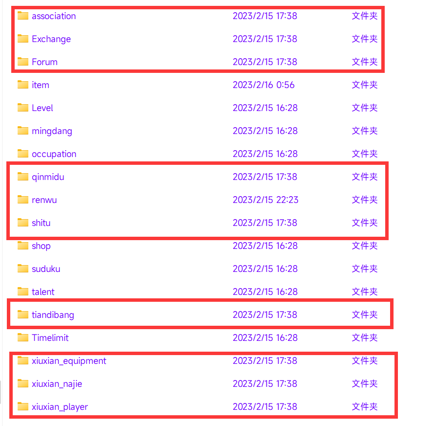

<div align="center">
<br>
<h1>绝云间修仙V1.2.5「附魔与拜师」</img></a></h1>
<br>
</div>

## 玩家攻略：[修仙攻略](https://docs.qq.com/doc/DSUhqZWdpZXJuUndZ?&u=4bd0757f64094c48b02d7cfc4eaeb44b)
## 安装

> Yunzai-Bot/目录下执行

```
git clone  https://gitee.com/so_numb/xiuxian-emulator-plugin.git ./plugins/xiuxian-emulator-plugin/
```         

## 转移存档

     
存档位置

```
Yunzai-Bot\plugins\xiuxian-emulator-plugin\resources\data
```      

若要转移存档，将上面画框的文件保存，将修仙插件删除，执行上面安装命令，将上面画框的文件替换到对应文件,然后执行【#一键同步】

## 更新完后一定要发【#一键同步】，不要偷懒直接保存data文件夹

## 修改内容

> 修改秘境等使之不再at 

> 给一键出售增加二次确认


## 鸣谢

> [DD斩首/绝云间修仙V1.3.0](https://gitee.com/hutao222/DDZS-XIUXIAN-V1.3.0)

> [小竹/xiuxian-emulator-plugin](https://gitee.com/zhu28/xiuxian-emulator-plugin)

> DD斩首(3196383818):仓库主人,合并,修复,优化和写新功能     
> 再氪两单嘛(3479823546):数值策划      
> 墨羽(1095365435):提供了宗门     
> 啵唧(1702701528):提供许多武器，秘境，特殊道具     
> xh(917951214):职业功能   
> 零(3106256704):修复bug,维护功能  
> RetuEase(1099177812):开发，维护功能  
> 香菜(3145625195):开发，维护  
> 画手(1589978621):维护和处理bug

## 配置与存档

> xiuxian-emulator-plugin/ config / xiuxian / xiuxian.yaml       
> xiuxian-emulator-plugin/ resources / data          
> 可根据需求自行修改

## 免责声明

1. 功能仅限内部交流与小范围使用
2. 请勿用于任何以盈利为目的的场景       